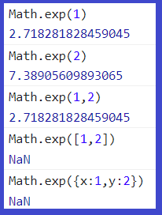
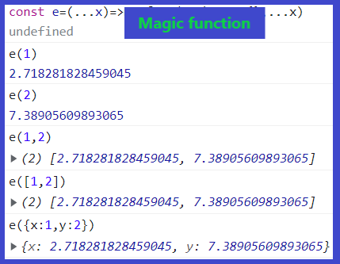

|Problem|Solution|
|-|-|
|||
# mapfunc
- `mapfunc` is a function that applies a mapping function to an infinite number of input elements, with options to skip certain elements and selectively apply the mapping to keys and/or values of objects.

- The `mapfunc` function has been developed in JavaScript and Python, offering the same functionality in different programming languages.
  - [Javascript](https://github.com/zakarialaoui10/mapfunc/tree/main/Javascript#readme)
    * [NPM](https://www.npmjs.com/package/mapfunc)
  - [Python](https://github.com/zakarialaoui10/mapfunc/tree/main/Python#readme) (Not published yet)

# License 
This projet is licensed under the terms of MIT License . 

